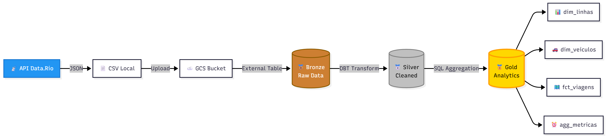

# CIVITAS - Pipeline BRT GPS

Pipeline de dados automatizado para o desafio [Prefeitura Rio - Civitas Data Engineering](https://github.com/prefeitura-rio/civitas-desafio-data-eng/).

**Autor:** Felipe Santoro Alcantara  
**Contato:** santoro.felipe@gmail.com

---

## 🚀 Como Executar

### 1. Configurar credenciais GCP

**Para avaliadores**: Solicite o arquivo de credenciais ao autor (santoro.felipe@gmail.com) e salve em:
```bash
credentials/civitas-data-eng-8feab1c31a9a.json
```

**Alternativa**: Crie sua própria service account (veja `credentials/README.md`)

### 2. Subir container
```bash
cd docker
docker-compose up -d
```

### 3. Executar pipeline
```bash
docker exec civitas-prefect-agent python -m pipelines.brt.extract_load.flows
```

**Tempo:** ~40 segundos

---

## � Arquitetura do Pipeline



**Fluxo**: API Data.Rio → CSV Local → GCS → Bronze (External Table) → Silver (DBT) → Gold (4 tabelas analíticas)

---

## �📦 Entregáveis

### Pipeline Prefect
- **Localização:** `pipelines/brt/extract_load/`
- **Tasks:** 11 tasks automatizadas (cleanup, fetch API, upload GCS, create tables, validações)
- **Arquitetura:** Bronze → Silver → Gold (Medallion)

### Projeto DBT
- **Localização:** `dbt/models/`
- **Bronze:** External Table (`brt_gps_external`)
- **Silver:** View transformada (`stg_brt_gps`)
- **Gold:** 4 tabelas analíticas criadas via SQL nativo

### Dados Processados
- **CSV exemplo:** `csv_exemplo_brt_gps.csv` (~730 registros)
- **API:** https://dados.mobilidade.rio/gps/brt
- **BigQuery:**
  - Bronze: 731 registros
  - Gold: 36 linhas + 731 veículos + 731 viagens + 40 métricas

### Docker
- **Localização:** `docker/`
- **Container:** `civitas-prefect-agent`
- **Stack:** Python 3.11 + Prefect 1.4.1 + DBT 1.7.0

---

## ✅ Validação

```sql
-- Bronze: External Table
SELECT COUNT(*) FROM `civitas-data-eng.civitas_bronze.brt_gps_external`;

-- Silver: View transformada
SELECT COUNT(*) FROM `civitas-data-eng.civitas_silver.stg_brt_gps`;

-- Gold: Tabelas analíticas
SELECT COUNT(*) FROM `civitas-data-eng.civitas_gold.dim_brt_linhas`;
SELECT COUNT(*) FROM `civitas-data-eng.civitas_gold.dim_brt_veiculos`;
```

---

## � Resultados (BigQuery)

Para visualizar os dados processados, utilize as credenciais incluídas no repositório (`credentials/civitas-data-eng-8feab1c31a9a.json`).

**Projeto GCP:** `civitas-data-eng`

### Tabelas Criadas

| Layer | Dataset | Tabela | Registros | Descrição |
|-------|---------|--------|-----------|-----------|
| 🥉 Bronze | `civitas_bronze` | `brt_gps_external` | 731 | External Table (CSV no GCS) |
| 🥈 Silver | `civitas_silver` | `stg_brt_gps` | 731 | View com transformações |
| 🥇 Gold | `civitas_gold` | `dim_brt_linhas` | 36 | Dimensão de linhas BRT |
| 🥇 Gold | `civitas_gold` | `dim_brt_veiculos` | 731 | Dimensão de veículos |
| 🥇 Gold | `civitas_gold` | `fct_brt_viagens` | 731 | Fato de viagens |
| 🥇 Gold | `civitas_gold` | `agg_metricas_horarias` | 40 | Métricas agregadas |

### Queries de Exemplo

```sql
-- Análise integrada: Linhas BRT com viagens e velocidades
SELECT 
    l.codigo_linha,
    l.total_veiculos,
    l.total_viagens,
    ROUND(l.velocidade_media, 2) as vel_media_linha,
    COUNT(DISTINCT v.id_viagem) as viagens_detalhadas,
    ROUND(AVG(v.velocidade_media), 2) as vel_media_viagens
FROM `civitas-data-eng.civitas_gold.dim_brt_linhas` l
LEFT JOIN `civitas-data-eng.civitas_gold.fct_brt_viagens` v 
    ON l.codigo_linha = v.linha_brt
GROUP BY l.codigo_linha, l.total_veiculos, l.total_viagens, l.velocidade_media
ORDER BY l.total_viagens DESC
LIMIT 10;
```

**Insights da query:**
- Combina dimensões (linhas), fatos (viagens) e agregações (métricas horárias)
- Mostra quais linhas têm mais viagens e suas velocidades médias
- Demonstra a arquitetura Medallion em ação (Gold como camada analítica)

---

## 👤 Autor

**Felipe Santoro Alcantara**  
📧 santoro.felipe@gmail.com  
🔗 [GitHub](https://github.com/flpsantoro) | [LinkedIn](https://www.linkedin.com/in/felipesantoroalcantara/)

---

**Desafio:** https://github.com/prefeitura-rio/civitas-desafio-data-eng/
